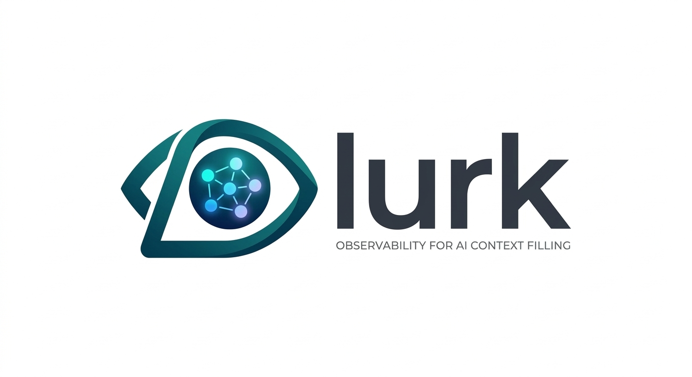

<p align="center">
  
</p>
<p align="center"><strong>Your AI agents have no idea what each other are doing. lurk fixes that.</strong></p>

<p align="center">
  <a href="#get-started">Get started</a> &middot;
  <a href="#how-it-works">How it works</a> &middot;
  <a href="#commands">Commands</a> &middot;
  <a href="#mcp-tools">MCP Tools</a> &middot;
  <a href="#configuration">Configuration</a>
</p>

---

lurk is a **context broker for AI tools**. It silently observes your desktop — VS Code, iTerm, Chrome, Slack, Notion, Figma, Gmail, Linear, and 30+ other apps — and makes that context available to every AI agent you work with.

Claude Code doesn't know what you just read in Slack. Cursor doesn't know what Claude Code just refactored. OpenClaw doesn't know you already fixed the bug it's about to file. lurk sees all of it and gives every tool the full picture.

**Context evolves across agents.** When Claude Code builds something, it feeds back what it decided and why. When you switch to ChatGPT, ChatGPT doesn't just get "the user was coding" — it gets the full picture of what was built, what decisions were made, and what's still open. Each prompt builds on the previous one.

**No integrations. No plugins. No API keys to configure.** lurk works by reading window titles and app states — the same information already visible on your screen.

```
$ lurk agents

Active AI Agents
┌──────────────┬──────────────┬───────────┬──────────┬──────────────────────────┐
│ Tool         │ State        │ Project   │ Duration │ Task                     │
├──────────────┼──────────────┼───────────┼──────────┼──────────────────────────┤
│ Claude Code  │ needs_review │ api       │ 12m      │ auth refactor            │
│ Cursor Agent │ working      │ dashboard │ 6m       │ component generation     │
│ OpenClaw     │ working      │ api       │ 41m      │ triage + issue responses │
└──────────────┴──────────────┴───────────┴──────────┴──────────────────────────┘

Attention Queue
┌──────────┬─────────────┬────────────────────────────────────┬─────────┐
│ Priority │ Agent       │ Reason                             │ Waiting │
├──────────┼─────────────┼────────────────────────────────────┼─────────┤
│ 1        │ Claude Code │ Completed — waiting for review     │ 12m     │
└──────────┴─────────────┴────────────────────────────────────┴─────────┘

$ lurk context

  coding in VS Code
  File: auth-middleware.ts
  Project: api
  Language: TypeScript
  Intent: implementing
  Duration: 47m
  Input: typing
  Interruptibility: low
```

## Why

A real morning looks like this: You open Claude Code in iTerm to refactor the auth middleware. While it works, you switch to Cursor to build out the dashboard components. You have OpenClaw running in a Chrome tab, triaging GitHub issues and responding to bug reports on your behalf. You flip to Notion to update the sprint doc. A Slack notification pulls you into a thread about a deploy. You check Gmail for the security audit response. Then you go back to Claude Code — which finished 8 minutes ago — and can't remember what it changed.

Every tool you touch is an island. Claude Code doesn't know you just read a Slack thread about the deploy failing. Cursor doesn't know Claude Code just rewrote the auth module it depends on. OpenClaw is filing issues against code that Claude Code already fixed. You're the only one holding context across all of them, and you're losing it every time you switch windows.

lurk fixes this by watching what's already on your screen and making that context available to every tool — without any of them needing to talk to each other.

### What this looks like in practice

**Cross-agent context transfer.** You finish reviewing Claude Code's auth refactor in iTerm and switch to Cursor to work on the dashboard. Cursor calls lurk's MCP server and instantly knows: *"The user just finished an auth refactor with Claude Code — auth-middleware.ts, auth-utils.ts, and auth.test.ts were modified in the api project. The dashboard component you're building imports from the auth module that was just changed."*

**Agent attention queue.** Claude Code has been waiting for your review for 12 minutes. Cursor is still actively generating. OpenClaw is running fine. Instead of checking each one manually, `lurk agents` shows you exactly who needs you and in what order.

**Full-stack awareness.** lurk sees everything: the Linear ticket (AUTH-142) you had open, the Stack Overflow page about JWT refresh tokens you researched in Arc, the 35-minute focused coding session in VS Code, the Figma mockup you referenced, the Slack thread where the team discussed the deploy. When any AI tool asks for context, it gets the full picture — not just what happened inside its own window.

**Context recovery.** You come back from a Zoom standup and can't remember what was running. `lurk agents` shows: *"Claude Code completed auth refactor (waiting for review since 10:15 AM). Cursor agent is still generating dashboard components (28 minutes in). OpenClaw processed 4 issues while you were away."*

**Evolving context.** Claude Code finishes the auth refactor and calls `add_workflow_context(type="decision", content="Chose JWT with RS256 over session auth — API is stateless")`. When you switch to ChatGPT to discuss the deployment strategy, ChatGPT's context includes that decision. When you later open Cursor to build the dashboard, Cursor knows the auth layer uses JWT with RS256 without you explaining it again.

## How it works

lurk has three layers:

1. **A native macOS daemon** (Swift) that observes your desktop at 3-second intervals — active app, window title, input state, display layout. Events are stored locally in a SQLite database at `~/.lurk/store.db`. Everything stays on your machine.

2. **A Python context engine** that enriches raw events into structured context — parsing window titles to extract file names, project names, languages, tickets, and AI agent states. It clusters activity into **workflows** that accumulate context over time.

3. **A feedback loop** — agents can write back decisions, findings, and summaries via MCP or HTTP, so the next agent starts with full context.

```
Observations ──→ Workflow Context ──→ Prompt Generation ──→ Agent
     ↑                                                        │
     │                                                        │
     └──────────── Agent Output Feedback ←─────────────────────┘
```

```
┌───────────────────────────────────────────────────────────────────┐
│                          Your Desktop                             │
│  iTerm2 · VS Code · Cursor · Chrome · Slack · Notion · Figma ... │
└──────────────────────────────┬────────────────────────────────────┘
                   │ window titles, app switches
                   ▼
         ┌─────────────────┐
         │   lurk-daemon   │  Swift · macOS native
         │   (observer)    │  accessibility API
         └────────┬────────┘
                  │ raw events → SQLite
                  ▼
         ┌─────────────────┐
         │  context engine  │  Python · parsers
         │  (enrichment)    │  classifiers · LLM
         └────────┬────────┘
                  │ structured context
          ┌───────┴───────┐
          ▼               ▼
   ┌────────────┐  ┌────────────┐
   │ MCP Server │  │ HTTP API   │
   │ (stdio)    │  │ :4141      │
   └──────┬─────┘  └──────┬─────┘
          │               │
          ▼               ▼
    Claude Code      ChatGPT, scripts,
    Cursor           dashboards, etc.
          │               │
          └───────┬───────┘
                  │ feedback (decisions,
                  │ findings, summaries)
                  ▼
         ┌─────────────────┐
         │   Workflow       │  Context accumulates
         │   (evolving)     │  across agents
         └─────────────────┘
```

### What lurk observes

| Signal | Source | Example |
|--------|--------|---------|
| Active app | macOS APIs | `VS Code`, `iTerm2`, `Chrome`, `Slack`, `Notion` |
| Window title | Accessibility API | `auth-middleware.ts — api — VS Code` |
| Input state | Event taps | typing, idle, mouse-only |
| Display layout | CoreGraphics | which app on which monitor |
| Calendar | EventKit | meeting in 5 minutes |

### What lurk infers

- **Files and projects** — parsed from VS Code, Cursor, Xcode, JetBrains, and terminal titles
- **Languages** — from file extensions (`auth-middleware.ts` → TypeScript)
- **Activity type** — coding, researching, communicating, designing, writing, meeting, planning, spreadsheet work
- **Google Workspace** — document names from Docs, Sheets, Slides; Gmail compose vs. triage vs. reading; Calendar events; Meet calls
- **AI agent states** — Claude Code working, Cursor generating, Codex running, ChatGPT active
- **Intent** — debugging, implementing, reviewing, researching
- **Interruptibility** — deep focus (35 min in VS Code) vs. casual browsing (skimming Reddit)
- **Tickets** — JIRA/Linear IDs from branch names, editor titles, and browser tabs
- **Research trail** — Stack Overflow pages, MDN docs, GitHub issues you visited
- **Communication context** — which Slack workspace/channel, Gmail composing vs. triaging, Notion page being edited

### Agent detection

lurk recognizes AI agents from observable signals without any integration:

| Agent | Detection method |
|-------|-----------------|
| Claude Code | Terminal title: `claude — Thinking...`, `claude — Allow tool?` |
| Codex | Terminal title: `codex` CLI patterns |
| ChatGPT | Browser tab title: `ChatGPT` |
| Cursor | Window title during composer/agent mode |
| Copilot | Editor integration and browser tab patterns |
| Copilot Workspace | Browser tab title patterns |
| Aider | Terminal title: `aider — Thinking` |
| OpenClaw / MyClaw | Browser tab title patterns |
| Goose | Terminal title patterns |

Agent states are inferred from title changes over time — a burst of rapid file changes means "working", a stable title after a burst means "completed", no change for an unusually long time means "possibly stuck".

### Observers

lurk uses a generic **WorkflowObserver** protocol. Built-in observers poll git repos for diffs, read Claude Code session logs, and receive browser extension captures. Adding a new context source (Slack, Google Docs, email, etc.) is one class:

```python
from lurk.observers import WorkflowObserver, WorkflowUpdate

class SlackObserver:
    def check(self) -> list[WorkflowUpdate]:
        return [WorkflowUpdate(
            keywords=["project-alpha", "deployment"],
            breadcrumb="discussing Project Alpha deployment in #engineering",
            tool="Slack",
        )]
```

### Workflows

Activity is clustered into **workflows** — coherent threads of work that span tools and time. A workflow might include Claude Code building auth middleware, a Stack Overflow search about JWT, a Google Doc with the API design, and a Slack thread about the deploy — all connected by topic overlap.

Each workflow accumulates structured context: breadcrumbs, agent contributions, research, code changes, documents, and key decisions. When you switch tools, the next agent gets the full evolving picture, not just a snapshot.

## Get started

**Requirements:** macOS 13+, Node.js 24+

```bash
npm install -g lurk-cli@latest

lurk onboard --install-daemon
```

The onboard wizard checks dependencies, builds the native daemon, installs the CLI, configures auto-start, prompts for Accessibility permission, and detects installed AI tools (Claude Code, Cursor) to automatically configure MCP integration — all in one step.

**Verify it's working:**
```bash
lurk status      # daemon running?
lurk context     # what does lurk see right now?
```

**Alternative install** (without npm):
```bash
curl -fsSL https://raw.githubusercontent.com/zasanao/lurk/main/install.sh | bash
```

### Connect AI tools

The onboard wizard auto-detects and connects your AI tools. If you need to reconnect or add a tool later:

```bash
lurk connect claude-code   # configure Claude Code MCP integration
lurk connect cursor        # configure Cursor MCP integration
lurk connect codex         # configure Codex CLI integration
```

### Browser extension (ChatGPT, Claude.ai, Gemini, Copilot)

For AI tools that run in the browser, lurk provides a Chrome extension that injects your context into any chat.

1. Start the HTTP API: `lurk serve-http`
2. Load the extension: Chrome → `chrome://extensions` → Enable Developer Mode → Load Unpacked → select the `extension/` folder
3. Visit ChatGPT, Claude.ai, Gemini, or Copilot — a small lurk button appears near the chat input
4. Click it to inject your current context into the message, or use the extension popup to copy/inject

No MCP required. Works with any browser-based AI tool.

### Quick copy (works everywhere)

```bash
lurk copy                  # copy context to clipboard, paste into any AI chat
lurk copy --watch          # keep clipboard updated every 30s
```

**LLM-enhanced context (optional):**
```bash
lurk config                # set llm.provider and llm.model
```

## Commands

```
lurk onboard        Guided setup — daemon, permissions, AI tool connections
lurk start          Start the daemon and context engine
lurk stop           Stop everything
lurk status         Show daemon status and event counts

lurk context        Show current context snapshot
lurk context -p     Show natural language context prompt
lurk agents         Show active AI agents and attention queue
lurk workflows      List active workflows with context trail
lurk changes        Show actual code diffs written by agents
lurk projects       List detected projects with activity stats
lurk log            Show recent raw events
lurk search <term>  Search event history

lurk pause          Pause observation (daemon stays running)
lurk resume         Resume observation

lurk copy            Copy context to clipboard (paste into any AI chat)
lurk copy --watch    Keep clipboard updated every 30s
lurk connect <tool>  Connect an AI tool (claude-code, cursor, codex)
lurk serve-mcp      Start MCP server (stdio, for Claude Code / Cursor)
lurk serve-http     Start HTTP API at localhost:4141 (needed for extension)

lurk config         Open config in $EDITOR
lurk purge          Clean up old data per retention policy
lurk install        Set up auto-start on login
lurk uninstall      Remove auto-start
lurk delete         Delete captured events
lurk debug <title>  Test a window title through the parser pipeline
```

## MCP Tools

When connected via MCP, AI agents can call these tools:

| Tool | Description |
|------|-------------|
| `get_current_context` | What the user is doing right now — app, file, project, activity, intent |
| `get_session_context` | Full work session — projects, files, research trail, focus blocks |
| `get_context_prompt` | Natural language preamble — draws from the active workflow's accumulated context |
| `get_project_context` | Deep context for a specific project |
| `get_agent_status` | All tracked AI agent sessions and their states |
| `get_attention_queue` | Priority-sorted list of agents needing human attention |
| `get_agent_context_for_handoff` | Context briefing for transferring work between agents |
| `get_workflow_summary` | High-level view of all concurrent work streams |
| `get_workflows` | List all detected workflows with topics, tools, and context |
| `get_workflow_context` | Full accumulated context for a specific workflow |
| `get_active_workflow_prompt` | Synthesized prompt from the active workflow |
| `add_workflow_context` | **Feed back** decisions, findings, blockers, summaries, or questions |
| `get_recent_code_changes` | Actual diffs of what agents wrote |
| `get_code_changes_summary` | Readable summary of recent code changes |
| `get_agent_session_context` | What happened in the last agent conversation |

### Example: what agents actually receive

When Claude Code calls `get_context_prompt`, it gets a natural language briefing that includes workflow context:

> *"The user is coding in VS Code, editing auth-middleware.ts in the api project (TypeScript). They've been in a focused session for 35 minutes. Key decisions: chose JWT with RS256 over session auth. Claude Code: built JWT auth middleware with token rotation. They recently researched JWT refresh token rotation on Stack Overflow. Related ticket: AUTH-142. Code changes: created auth/middleware.ts; modified server/http.ts."*

When you switch from Claude Code to Cursor, Cursor calls `get_agent_context_for_handoff` and gets:

> *"Claude Code was working on api for 47 minutes. Final state: completed. Files involved: auth-middleware.ts, auth-utils.ts, auth.test.ts, token-refresh.ts. The dashboard component you're building imports from the auth module that was just modified."*

When OpenClaw calls `get_current_context`, it knows the user is deep in a coding session with low interruptibility — so it can hold non-urgent notifications rather than interrupting.

## HTTP API

```bash
# Current context
curl localhost:4141/context/now

# Session context
curl localhost:4141/context/session

# Natural language prompt (includes workflow context)
curl localhost:4141/context/prompt

# Active workflow prompt
curl localhost:4141/context/workflow-prompt

# List workflows
curl localhost:4141/workflows

# Agent status
curl localhost:4141/agents

# Recent code changes
curl localhost:4141/changes/summary

# Feed back a decision from an agent
curl -X POST localhost:4141/context/feedback \
  -H 'Content-Type: application/json' \
  -d '{"type": "decision", "content": "Chose JWT over session auth because the API is stateless"}'
```

### Feedback types

Agents can write structured context back into the active workflow via `POST /context/feedback` or the `add_workflow_context` MCP tool:

| Type | Purpose | Example |
|------|---------|---------|
| `decision` | Record an architectural or design choice | "Chose PostgreSQL over SQLite for multi-user support" |
| `finding` | Record a research finding or discovery | "RS256 is the recommended signing algorithm for production" |
| `blocker` | Flag something that's blocking progress | "Missing JWKS endpoint configuration" |
| `summary` | Summarize what was just accomplished | "Built JWT auth middleware with token rotation" |
| `question` | Record an open question for follow-up | "Should refresh tokens use a separate signing key?" |

## Configuration

Edit `~/.lurk/config.yaml` or run `lurk config`:

```yaml
# Observation
observation:
  poll_interval: 3
  idle_threshold: 120
  session_gap: 300

# Never capture these
exclusions:
  apps: ["Messages", "FaceTime"]
  title_patterns: ["*bank*", "*medical*"]

# Context file targets
context_files:
  enabled: true
  targets:
    - lurk_context      # .lurk-context.md
    # - claude_md        # CLAUDE.md
    # - cursorrules      # .cursorrules

# Optional LLM for richer context
llm:
  provider: none        # none | ollama | anthropic | openai
  model: ""
  api_key: ""

# Data retention
retention:
  raw_events_days: 30
  sessions_days: 365
```

## Privacy

- All data stays on your machine in `~/.lurk/store.db`
- No telemetry, no cloud services, no accounts
- Exclude sensitive apps and title patterns via config
- `lurk pause` / `lurk resume` for instant control
- `lurk delete --all` to wipe everything
- Window title sanitization strips emails, URLs with auth tokens, and personal identifiers before storage

## Architecture

```
daemon/                         # Swift macOS daemon
  Sources/LurkDaemon/
    App/                        # AppDelegate, MenuBarController
    Observers/                  # Title, input, workspace, calendar observers
    Store/                      # SQLite database, buffered event writer
    IPC/                        # Unix socket server
    Sanitize/                   # Title sanitization

lurk/                           # Python context engine
  src/lurk/
    cli/                        # Typer CLI (lurk start, stop, context, etc.)
    config/                     # Settings, installation, retention
    context/                    # Context model, sessions, projects, agents, workflows
    enrichment/                 # Parser pipeline, classifiers, agent detection
    observers/                  # WorkflowObserver protocol, git watcher, session watcher
    parsers/                    # Per-app title parsers (VS Code, Chrome, Slack, Notion, Figma, Linear, ...)
    server/                     # MCP server, HTTP API, prompt generation, feedback endpoint
    store/                      # Database access layer
    writer/                     # Context file writer (.lurk-context.md, CLAUDE.md)
    llm/                        # Optional LLM integration for richer context
    sanitize/                   # Title sanitization rules
```

## License

MIT
